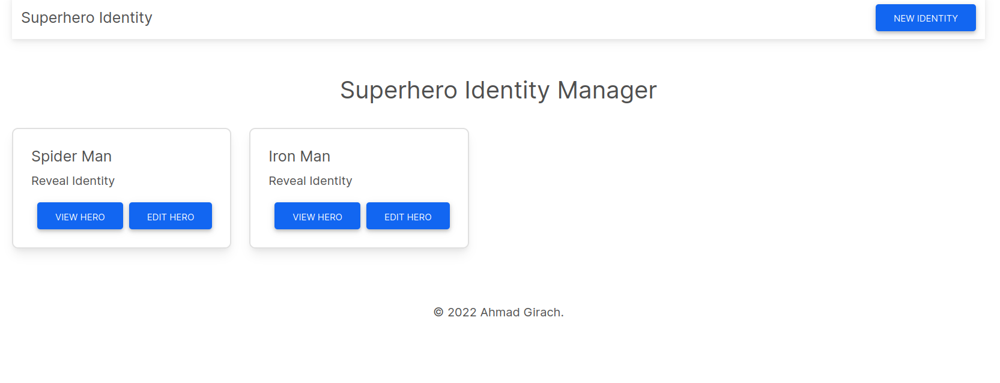

### About
This project demonstrates how we can build full stack apps using `Next.js`, have done basic CRUD implementation with Mongo.

### Run
- Change connection params (as per your need) inside `next.config.js`
- ```npm i```
- ```npm run dev```


### Key Takeaways
- CRUD APIs
- Mongoose
- Basic MDBootstrap React Components


### Preview



This project was built while learning from [this course by Hitesh Chaudhary](https://courses.learncodeonline.in/learn/NextJS-Full-stack-crash-course)